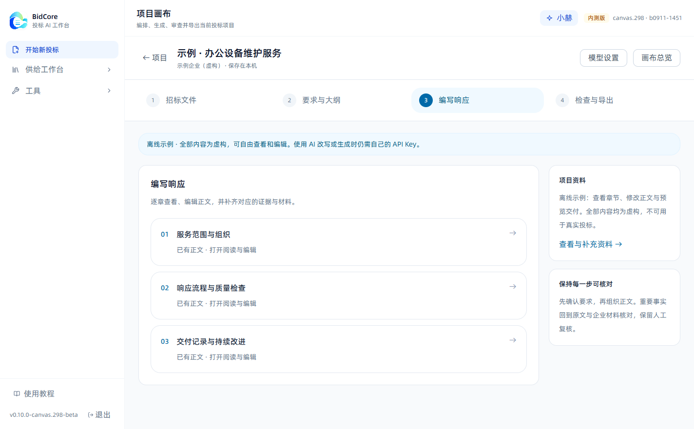

# BidCore

本地投标工作台：整理招标要求，复用企业材料，编写、检查并导出响应文件。

面向独立投标人员与中小投标团队，支持 Windows。项目文件与资料库保存在用户电脑，AI 功能连接用户自己的模型服务，API 费用由用户向服务商支付。

**发布状态：公开测试版准备中。** 本仓库先提供产品说明、使用文档和问题反馈。安装包通过验收后将在 [Releases](https://github.com/haozhentech/BidCore-Desktop/releases) 提供，当前尚无可下载的公开版本。

## 工作流程

当前开发版实机截图。示例企业与项目内容均为虚构。

1. 新建项目，选择投标主体并导入招标文件。
2. 阅读与确认要求、评分点和章节结构。
3. 关联企业资料，编写和修改响应内容。
4. 检查缺失材料与响应问题，完成人工复核。
5. 导出 Word 文件；正式交付前补齐要求的真实材料。

## 本地使用与 AI

- 企业档案、项目和资料库按投标主体组织。
- 使用自己的 API Key，不需要消耗开发者的模型额度。
- 提供可离线查看和编辑的示例项目；调用 AI 时再配置自己的模型服务。
- 使用云端 AI 时，完成该任务所需的相关内容会发送到配置的模型服务。
- 使用者决定连接哪些服务，并遵守对应服务条款和所在组织的数据要求。
- 生成结果需要人工核对，软件不会代替签章、报价决策或交易平台提交。

详见 [使用指南](docs/getting-started.md)、[数据与模型服务说明](docs/data-and-ai.md)、[常见问题](docs/faq.md) 和 [更新记录](CHANGELOG.md)。

## 当前范围

公开版正在验证货物采购、服务采购及多包等代表流程。复杂工程清单、报价计算和电子投标平台适配以具体版本明确列出的支持范围为准。

发现问题可到 [Issues](https://github.com/haozhentech/BidCore-Desktop/issues) 反馈。请仅提交脱敏的步骤、截图或虚构样例，勿上传 API Key、客户原件或未公开的投标材料。

## 关于本仓库

这是 BidCore 的公开产品、文档与版本发行仓库。核心软件源码为私有，本仓库不授予该源码的开源许可。二进制软件的使用范围以随版本提供的软件条款为准；第三方组件遵循各自许可证。

[产品网站](https://bidcore.cn/) · [反馈问题](https://github.com/haozhentech/BidCore-Desktop/issues/new/choose)
